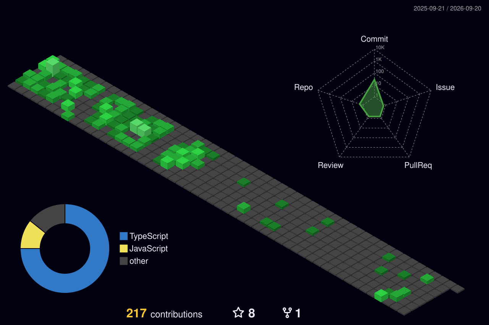

# Welcome to My Code Realm! 👾

Hey there! I'm **João Gualberto**, a passionate **Computer Science student** from IFMG - Campus Formiga, exploring the realms of **software and web development**, **electronics**, and **design**. Here, you'll find a blend of code, creativity, and caffeine-fueled projects. 🚀

## 🛠️ Technologies I Use 

[comment]: <> (Icons: https://simpleicons.org)
[comment]: <> (Badge Generator: https://michaelcurrin.github.io/badge-generator/#/generic)
[comment]: <> (Badge Samples: https://ileriayo.github.io/markdown-badges/)
- **Languages:**     
- **Web Development:**      
- **DataBase and Storage:**    
- **Embedded Systems:**  
- **Dev Tools:**    
- **Quality Assurance:**   

## 🌌 Current Adventures

- **🖥️ Building:** A app to help students organize stuff!
- **📚 Researching:** Noise-Canceling technology
- **🎨 Designing:** UI/UX prototypes for small projects.

## 🏢 Working as

System Developer at 

## 🎧 What I'm Jamming To

Love coding with music? Me too! Here's what I'm currently listening to on Spotify:

## 📊 GitHub in Action!

## 🚀 Let's Connect!

  

## ✨ Fun Fact

When I'm not coding or soldering circuits, you might find me exploring game development, producing songs or lost in a good book. 📖

Thanks for stopping by! Feel free to fork, star, or drop me a message. Happy coding! 😊
